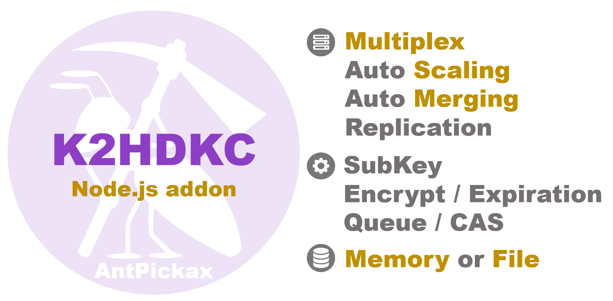

# **K2HDKC Node.js**
**K2HDKC Node.js** is addon library for Node.js of **K2HDKC** (K2Hash based Distributed Kvs Cluster) which is a proprietary distributed KVS with some features published by Yahoo! JAPAN.  
**K2HDKC Node.js** is a Node.js addon library as a client of **K2HDKC**, and all functions provided by the **K2HDKC** library as clients can be used in Node.js in the server side JavaScript environment [Node.js](https://nodejs.org/).
**K2HDKC Node.js** is one of [AntPickax](https://antpick.ax/)'s open source product by Yahoo! JAPAN.  

## {{ page.arrow_link_overview }}
[Overview](home.html) about **K2HDKC Node.js** library.

## {{ page.arrow_link_feature }}
The explanation of the detailed [Feature](feature.html) of **K2HDKC Node.js** library.

## {{ page.arrow_link_usage }}
How to [use](usage.html) **K2HDKC Node.js** library for your program.

## {{ page.arrow_link_build }}
How to [build](build.html) **K2HDKC Node.js** library from [source code]({{ site.github.repository_url }}) on Github.

## {{ page.arrow_link_developer }}
Detailed description of the programming interface provided by **K2HDKC Node.js** library for [developer](developer.html)s.

## {{ page.arrow_link_environments }}
Description of [Environment](environments.html) variables used by **K2HDKC Node.js** library to load.

# **About K2HDKC**
[K2HDKC](https://k2hdkc.antpick.ax/) (K2Hash based Distributed Kvs Cluster) is a distributed KVS with original featured function.
Please see the [K2HDKC](https://k2hdkc.antpick.ax/) details page.

# **About AntPickax**
[AntPickax](https://antpick.ax/) is product group that is provided as open source by Yahoo! JAPAN.  
Please see the [AntPickax](https://antpick.ax/) details page.
